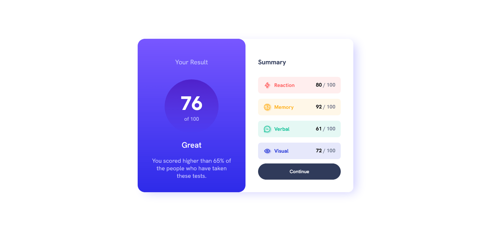

# Frontend Mentor - Results summary component

Esta es una solucion al desafio [Results summary component en Frontend Mentor](https://www.frontendmentor.io/challenges/results-summary-component-CE_K6s0maV).

## Overview

### Screenshot

### 🚀 Demo

- [Results summary component](https://kaelldrick.github.io/Results-summary-component/)

### 💻 Built with

- HTML5 semántico
- CSS
- REACT

## Author

- Frontend Mentor - [@Kaelldrick](https://www.frontendmentor.io/profile/Kaelldrick)